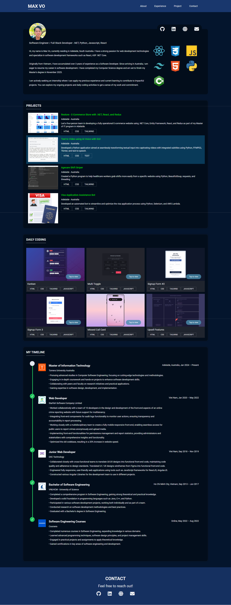

# Portfolio Website

Happy to share my first certificate from freeCodeCamp! It was fun to practice my skills and build another portfolio website for myself. 
Reach out to me if you have any ideas to modify it.

## Live Website

Check out the live portfolio website [here](https://mvocoding.github.io/Freecodecamp---Porfolio-Website/).

## Preview

Here's a preview of the portfolio website:

